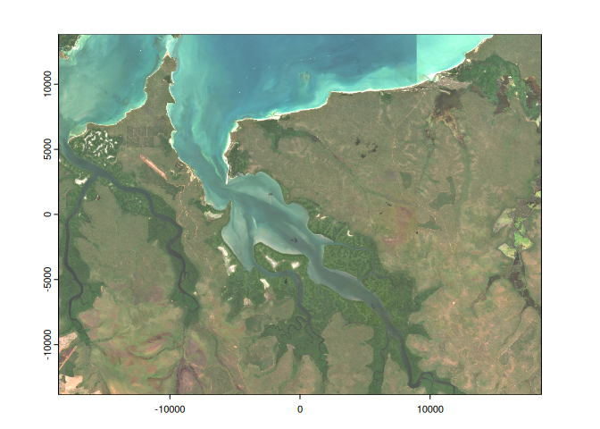

<!-- README.md is generated from README.Rmd. Please edit that file -->

# vrtility

<!-- badges: start -->

[](https://lifecycle.r-lib.org/articles/stages.html#experimental)
<!-- badges: end -->

The goal of vrtility is to make the best use of GDAL’s VRT capabilities
for efficient processing of large raster datasets - mainly with Earth
Observation in mind. This package’s primary focus is on the use of GDAL
VRT pixel functions using python. These python pixel functions are used
to apply cloud masks and summarise pixel values (e.g. median) from
multiple images (i.e create a composite image). For now we’re just using
the python pixel function capabilities but hope to add C++ or
expressions in time.

## Features

- No intermediate downloads - the use of nested VRTs enables the
  download and processing of only the required data in a single gdalwarp
  call. This reduces disk read/write time.

- use of numba in python pixel function(s) - not always faster but can
  be.

- modular design: We’re basically creating remote sensing pipelines
  using nested VRTs. This allows for the easy addition of new pixel
  functions and masking functions. but could easily be adapted for
  deriving spectral indices or calculating complex time series
  functions.

## TO DO:

- [ ] Add additional pixel functions (geometric median in particular).
- [ ] time series functions…

## Installation

You can install the development version of vrtility from
[GitHub](https://github.com/) with:

``` r
# install.packages("pak")
pak::pkg_install("Permian-Global-Research/vrtility")
# next set up the required Python environment
vrtility::build_vrtility_python()
```

### Possible extra steps.

For now, {vrtility} requires the use of a virtual python environment -
this is a lighter and safer way to manage python envs than with conda or
the system python, respectively. It may be necessary to install the
virtualenv package for python3.

This can be done on Debian/Ubuntu with:

    sudo apt-get install python3-venv

or if on MacOS or Windows, you can install it with pip:

    python3 -m pip install virtualenv

## Example

Here is a simple example where we: define a bounding box, search a STAC
catalog for Sentinel-2 data, create a vrt_collection object (basically a
list of warped VRTs). We then apply the masking using pixel functions (I
can’t get internal or external masks to work for these VRTs), finally
these images are stacked (combined into a single VRT with multiple
layers in each VRTRasterBand), the median pixel function is then added
to the VRT and all of this is then “lazily” calculated at the end of the
vrt pipeline using gdalwarp.

``` r
library(vrtility)
library(tictoc)

bbox <- gdalraster::bbox_from_wkt(
  wkt = wk::wkt("POINT (144.3 -7.6)"),
  extend_x = 0.17,
  extend_y = 0.125
)

trs <- to_projected(bbox)

te <- gdalraster::bbox_transform(
  bbox,
  gdalraster::srs_to_wkt("EPSG:4326"),
  trs
)

s2_stac <- sentinel2_stac_query(
  bbox = bbox,
  start_date = "2023-01-01",
  end_date = "2023-12-31",
  max_cloud_cover = 35,
  assets = c(
    "B02",
    "B03",
    "B04",
    "SCL"
  )
)
tic()
median_composite <- vrt_collect(
  s2_stac,
  t_srs = trs, te = te, tr = c(10, 10), mask_band = "SCL"
) |>
  vrt_set_maskfun(,
    valid_bits = c(4, 5, 6, 7, 11)
  ) |>
  vrt_stack() |>
  vrt_set_pixelfun() |>
  vrt_warp(
    outfile = fs::file_temp(ext = "tif"),
    quiet = TRUE
  )
toc()
#> 124.631 sec elapsed
```

``` r

plot_raster_src(
  median_composite,
  c(3, 2, 1),
  minmax_def = c(rep(750, 3), rep(2750, 3))
)
```


