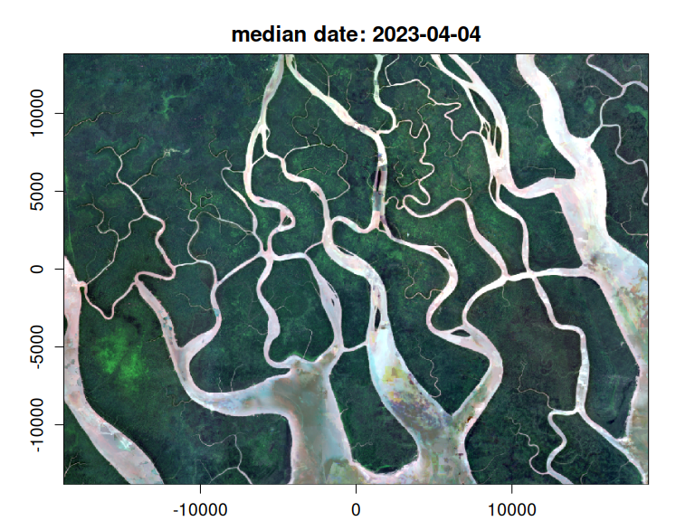
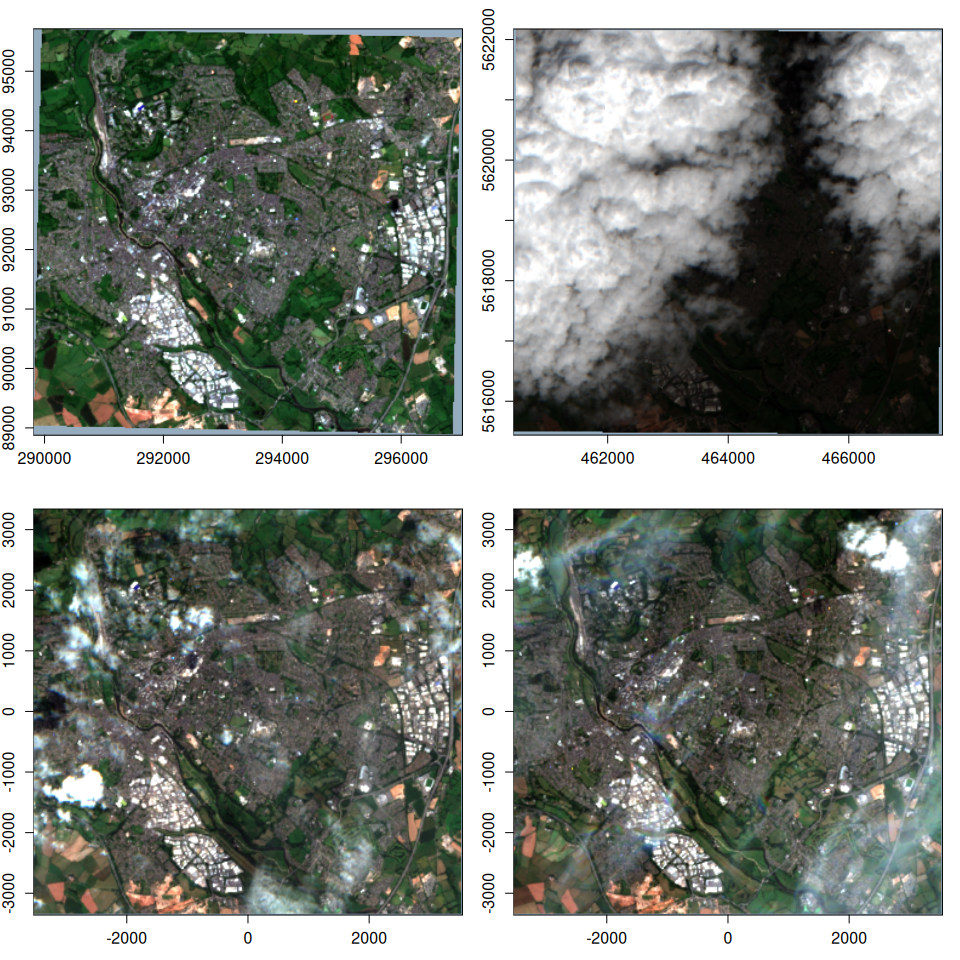
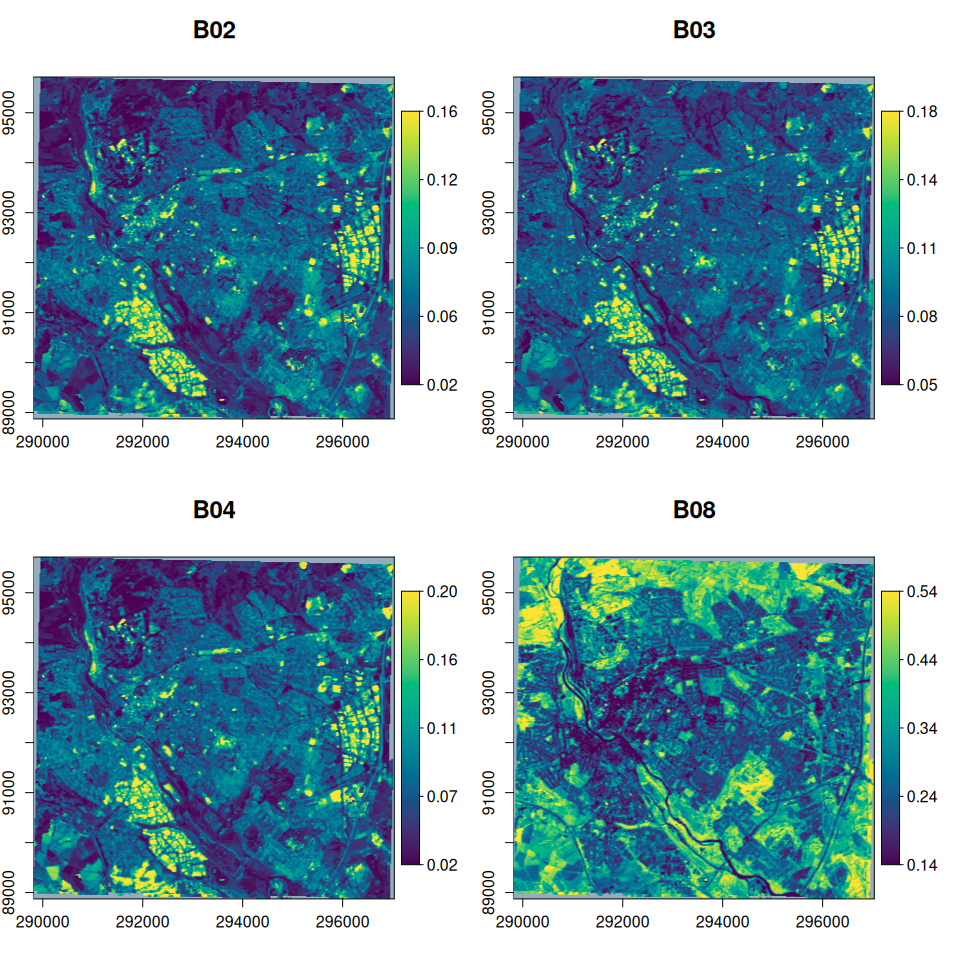

<!-- README.md is generated from README.Rmd. Please edit that file -->

# vrtility

<!-- badges: start -->

[](https://lifecycle.r-lib.org/articles/stages.html#experimental)
[](https://github.com/Permian-Global-Research/vrtility/actions/workflows/R-CMD-check.yaml)
[](https://app.codecov.io/gh/Permian-Global-Research/vrtility?branch=main)
<!-- badges: end -->


vrtility is an R package that aims to make the best use of
[GDAL](https://gdal.org/en/stable/index.html)’s
[VRT](https://gdal.org/en/stable/drivers/raster/vrt.html) capabilities
for efficient processing of large raster datasets - mainly with Earth
Observation in mind. This package’s primary focus is on the use of GDAL
VRT pixel functions using python. These [numpy](https://numpy.org/)
based python pixel functions are used to apply cloud masks and summarise
pixel values (e.g. median) from multiple images (i.e create a composite
image). These main features are made possible by the
[{gdalraster}](https://usdaforestservice.github.io/gdalraster/index.html)
and [{reticulate}](https://rstudio.github.io/reticulate/) packages.

<!-- ```{=gfm}
> [!CAUTION]
> This package is under active development and is likely to change. Contributions and suggestions are still very welcome!
``` -->

## Features

- No intermediate downloads - the use of nested VRTs enables the
  download and processing of only the required data in a single gdalwarp
  (or gdal_translate) call. This reduces disk read/write time.

- modular design: We’re basically creating remote sensing pipelines
  using nested VRTs. This allows for the easy addition of new pixel
  functions and masking functions. but could easily be adapted for
  deriving spectral indices or calculating complex time series
  functions.

- extremely efficient parallel processing using gdalraster and
  [mirai](https://shikokuchuo.net/mirai/) when using the “gdalraster”
  compute engine.

## Installation

You can install vrtility from GitHub with:

``` r
# install.packages("pak")
pak::pkg_install("Permian-Global-Research/vrtility")
```

## Example

Here is a simple example where we:

1.  Define a bounding box and search a STAC catalog for Sentinel-2 data

2.  Create a `vrt_collection` object - essentially a list of individual
    VRTs (each making up one image) which we refer to as `vrt_block`s in
    this package.

3.  Then, we apply the mask using pixel functions. This simply modifies
    the XML of the VRT “blocks”.

4.  Because this set of images have more than one common spatial
    reference system (SRS) we convert the `vrt_block`s in the
    `vrt_collection` to warped VRTs, giving us a `vrt_collection_warped`
    object.

5.  These images are then “stacked” (combined into a single VRT with
    multiple layers in each VRTRasterBand), giving us a `vrt_stack`
    object.

6.  A median pixel function is then added to the `vrt_stack`.

7.  all of this is then executed at the end of the vrt pipeline using
    `vrt_compute`. Here we are using the `gdalraster` engine to write
    the output which, in combination with the mirai package downloads
    and processes the data in parallel across bands and within bands (as
    determined by the `nsplits` argument).

``` r
library(vrtility)

#  Set up asynchronous workers to parallelise vrt_collect and vrt_set_maskfun
mirai::daemons(10)
#> [1] 10
```

``` r

bbox <- gdalraster::bbox_from_wkt(
  wkt = wk::wkt("POINT (144.3 -7.6)"),
  extend_x = 0.17,
  extend_y = 0.125
)

te <- bbox_to_projected(bbox)
trs <- attr(te, "wkt")

s2_stac <- sentinel2_stac_query(
  bbox = bbox,
  start_date = "2023-01-01",
  end_date = "2023-12-31",
  max_cloud_cover = 35,
  assets = c("B02", "B03", "B04", "SCL")
)
# number of items:
length(s2_stac$features)
#> [1] 14
```

``` r

system.time({
  median_composite <- vrt_collect(s2_stac) |>
    vrt_set_maskfun(
      mask_band = "SCL",
      mask_values = c(0, 1, 2, 3, 8, 9, 10, 11)
    ) |>
    vrt_warp(t_srs = trs, te = te, tr = c(10, 10)) |>
    vrt_stack() |>
    vrt_set_pixelfun() |>
    vrt_compute(
      outfile = fs::file_temp(ext = "tif"),
      engine = "gdalraster"
    )
})
#>    user  system elapsed 
#>   5.522   0.457  48.981
```

``` r

plot_raster_src(
  median_composite,
  c(3, 2, 1)
)
```



## Asynchronous download/processing

{vrtility} uses {mirai}, alongside {purrr} to manage asynchronous
parallelisation. By setting `mirai::daemons(n)` before running the vrt
pipeline, we can improve performance, depending on the speed of the
server holding the data. In some cases this will make little difference
for example, the Microsoft Planetary Computer STAC API is already pretty
fast. However, for NASA’s Earthdata STAC API, this can make a huge
difference. Paralellism is available in three functions at present:
`vrt_collect`, `vrt_set_maskfun` and `vrt_compute`. In order to use
asynchronous processing, in the `vrt_compute` function, we need to set
`engine = "gdalraster"`. The “gdalraster” engine is always parallelised
across bands by default, then a further nested parallelisation step is
possible within bands by setting `nsplits` to a value greater than 1. If
you want to reduce the number of processes used, explicitly set
`mirai::daemons(1)` or just use the “warp” engine.

## Using on-disk rasters

We can also use on-disk raster files too, as shown here with this
example dataset - note that the inputs have multiple spatial reference
systems and therefore we need to warp them (as in the above example)
before stacking. If your images are all in the same CRS, you might save
a lot of time by warping only once in `vrt_compute`. We can plot these
`vrt_{x}` objects using `plot()` but note that for very large rasters,
where we are computing pixel functions, this can be slow and we are
better off using `vrt_compute` to write to disk and then plotting the
output.

``` r
s2files <- fs::dir_ls(system.file("s2-data", package = "vrtility"))[1:4]

ex_collect <- vrt_collect(s2files)
par(mfrow = c(2, 2))
purrr::walk(
  seq_len(ex_collect$n_items),
  ~ plot(ex_collect, item = .x, bands = c(3, 2, 1))
)
```



``` r

ex_collect_mask <- vrt_set_maskfun(
  ex_collect,
  mask_band = "SCL",
  mask_values = c(0, 1, 2, 3, 8, 9, 10, 11),
)

purrr::walk(
  seq_len(ex_collect_mask$n_items),
  ~ plot(ex_collect_mask, item = .x, bands = c(3, 2, 1))
)
```


``` r

# extract a block to use as a template for warping
t_block <- ex_collect[[1]][[4]]

ex_composite <- vrt_warp(
  ex_collect_mask,
  t_srs = t_block$srs,
  te = t_block$bbox,
  tr = c(20, 20)
) |>
  vrt_stack() |>
  vrt_set_pixelfun(pixfun = median_numpy())

par(mfrow = c(1, 1))
plot(ex_composite, bands = c(3, 2, 1), quiet = TRUE)
```



``` r

# write to disk if we wanted to...
# vrt_compute(
#   ex_composite,
#   outfile = fs::file_temp(ext = "tif"),
#   engine = "warp"
# )
```

## TO DO:

- [ ] Add additional pixel functions (geometric median in particular).
- [ ] Add default C++ pixel functions.
- [ ] time series functions…
- [ ] Add custom C++ or expression based pixel functions
