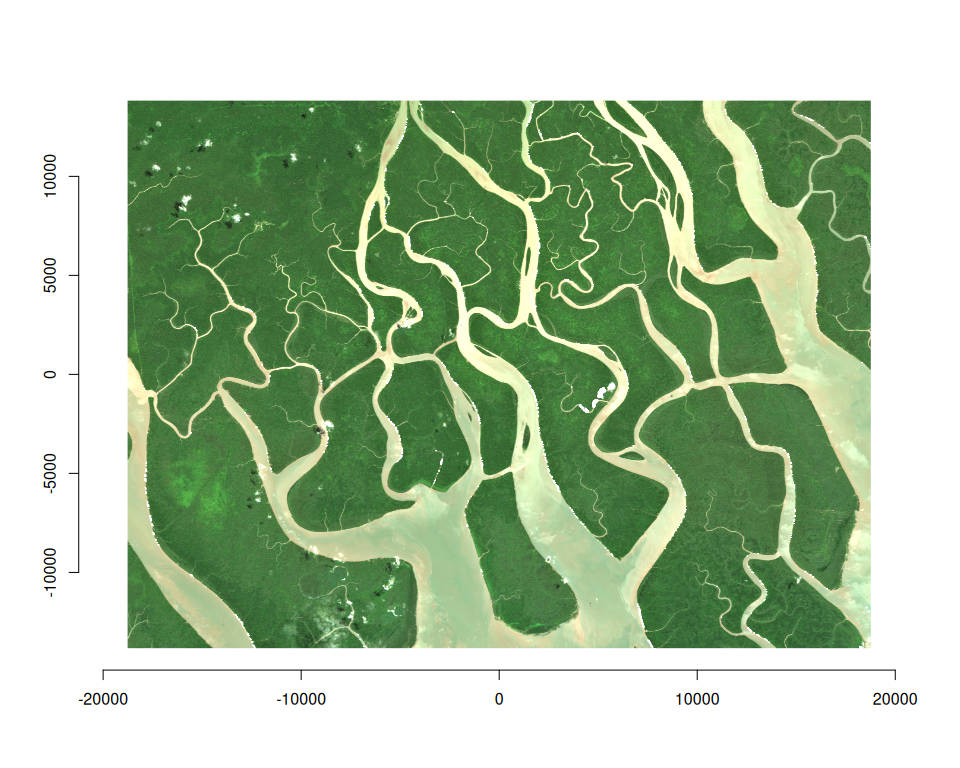
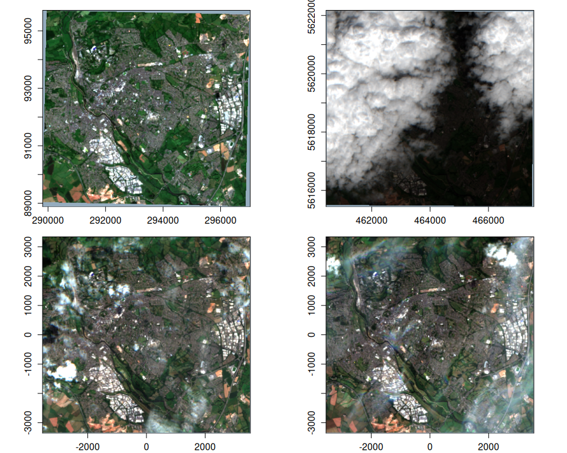
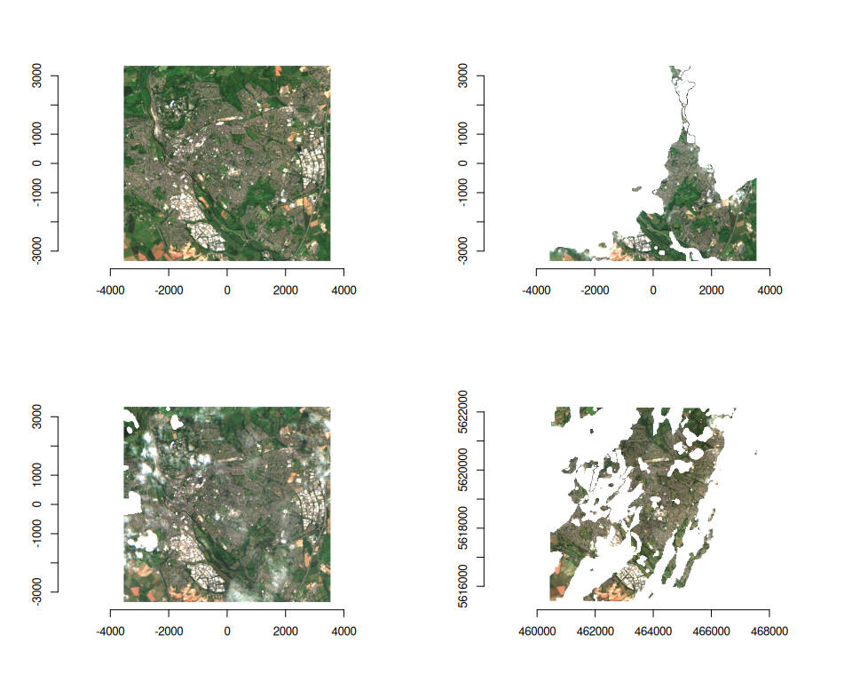
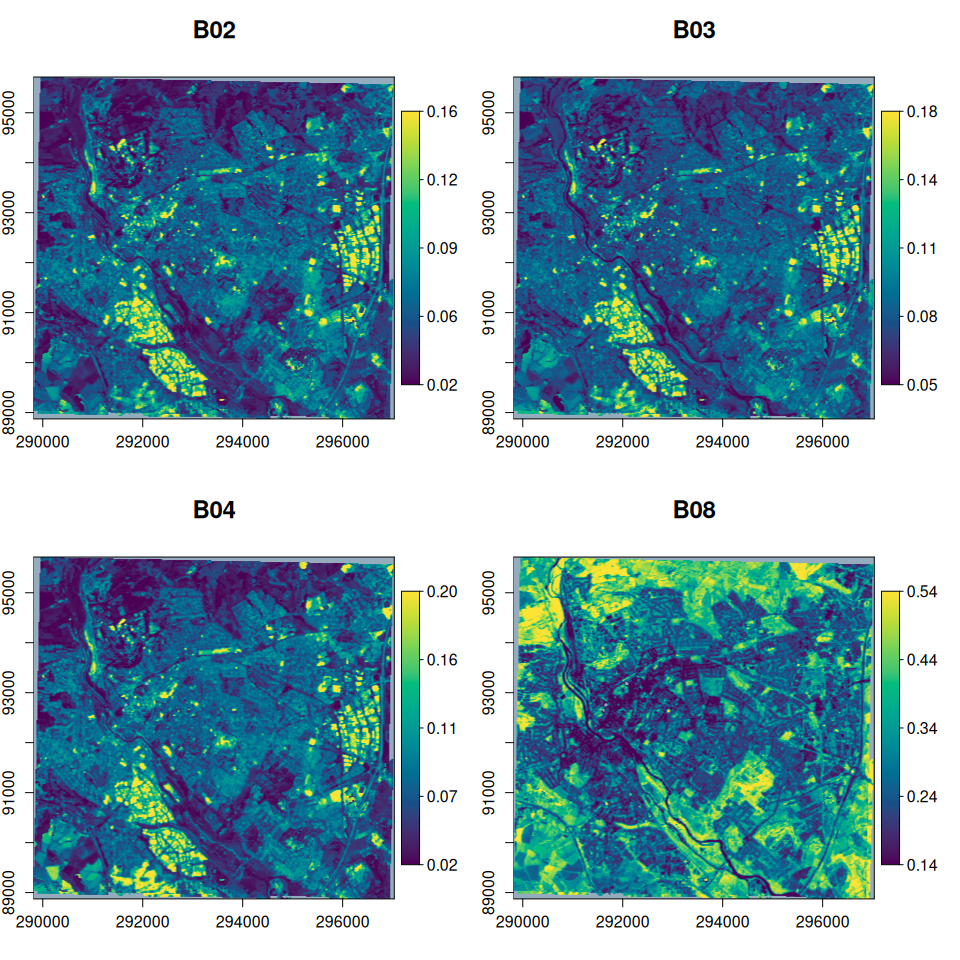

# vrtility [](https://permian-global-research.github.io/vrtility/)

vrtility is an R package that makes efficient use of
[GDAL](https://gdal.org/en/stable/index.html)’s
[VRT](https://gdal.org/en/stable/drivers/raster/vrt.html) (Virtual
Raster) capabilities for processing large raster datasets, with a focus
on Earth Observation (EO) applications. The package leverages VRT pixel
functions and harnesses the VRT data structure to facilitate complex
image processing tasks such as multi-band compositing and time series
filtering.

> \[!NOTE\] This package is under active development and is likely to
> change. Contributions and suggestions are still very welcome!

## Features

- **Modular design**: Creates remote sensing pipelines using nested
  VRTs, allowing easy addition of new pixel and masking functions. Can
  be adapted for deriving spectral indices or calculating complex time
  series functions. All powered by
  [{gdalraster}](https://firelab.github.io/gdalraster/).

- **Python and C++ pixel functions**: Enables use of both GDAL VRT
  Python and built-in (C++) pixel functions. Python
  [numpy](https://numpy.org/)-based pixel functions can apply cloud
  masks and summarize pixel values (e.g., median) from multiple images
  to create composite images. Python environment and package management
  is handled by [{reticulate}](https://rstudio.github.io/reticulate/).
  Built-in GDAL pixel functions are highly performant and vary by GDAL
  version—recent versions support [muparser
  expressions](https://gdal.org/en/latest/drivers/raster/vrt.html#using-derived-bands-with-pixel-functions-in-c)
  (3.11.4+) and median compositing (3.12.0+), for example.

- **Efficient parallel processing**: Uses
  [{mirai}](https://mirai.r-lib.org/index.html) for asynchronous,
  multi-core processing.

- **Advanced multi-band compositing methods**: Maintain spectral
  consistency using methods such as the geometric median and medoid.

- **Time series filtering**: Improve temporal consistency and reduce
  noise in multi-temporal datasets.

- **Cloud masking**: Apply cloud mask filtering using pixel functions,
  including support for
  [OmniCloudMask](https://github.com/DPIRD-DMA/OmniCloudMask)
  cloud/shadow masking embedded within VRT pipelines.

## Installation

You can install vrtility from GitHub with:

``` r
# install.packages("pak")
pak::pkg_install("Permian-Global-Research/vrtility")
```

## Example

This example demonstrates the creation of a cloud-masked median
composite from Sentinel-2 data:

1.  Define a bounding box and search a STAC catalog for Sentinel-2 data.

2.  Create a `vrt_collection` object — a list of individual VRTs
    (referred to as `vrt_block`s), with each representing one image.

3.  Apply cloud masking using pixel functions, which modifies the XML of
    each VRT block.

4.  Warp the `vrt_block`s to a common spatial reference system (SRS)
    using `vrt_warp`, creating a spatially-aligned
    `vrt_collection_warped` object. Note: For remote data sources,
    warping with `lazy = FALSE` (the default) forces GDAL to materialize
    the warped VRTs immediately, which is typically much faster.

5.  Stack the images (combine into a single VRT with multiple layers per
    band), creating a `vrt_stack` object.

6.  Add a median pixel function to the `vrt_stack`.

7.  Compute the median composite using `vrt_compute` with the
    `gdalraster` engine, which processes the data in parallel across
    bands and image blocks using mirai daemons.

``` r
library(vrtility)
#> ✔ Using GDAL version 3.12.0
#> ℹ GDAL_CACHEMAX set to 6.247 GiB; to change this use
#>   `vrtility::set_gdal_cache_max()`.
#  Set up asynchronous workers to parallelise vrt_collect and vrt_set_maskfun
mirai::daemons(8)
daemons_load_vrtility()

bbox <- gdalraster::bbox_from_wkt(
  wkt = "POINT (144.3 -7.6)",
  extend_x = 0.17,
  extend_y = 0.125
)

te <- bbox_to_projected(bbox)
trs <- attr(te, "wkt")

s2_stac <- hls_stac_query(
  bbox = bbox,
  start_date = "2023-01-01",
  end_date = "2023-12-31",
  stac_source = "https://planetarycomputer.microsoft.com/api/stac/v1/",
  collection = "hls2-s30",
  max_cloud_cover = 40,
  assets = c("B02", "B03", "B04", "Fmask")
)
# number of items:
length(s2_stac$features)
#> [1] 10

system.time({
  median_composite <- vrt_collect(s2_stac) |>
    vrt_set_maskfun(
      mask_band = "Fmask",
      mask_values = c(0, 1, 2, 3),
      build_mask_pixfun = build_bitmask()
    ) |>
    vrt_warp(t_srs = trs, te = te, tr = c(30, 30)) |>
    vrt_stack() |>
    vrt_set_py_pixelfun(pixfun = median_numpy()) |>
    # vrt_set_gdal_pixelfun(pixfun = "median") # if using GDAL >= 3.12.0
    vrt_compute(
      engine = "gdalraster"
    )
})
#>    user  system elapsed 
#>   1.091   0.164   5.718


plot_raster_src(
  median_composite,
  c(3, 2, 1)
)
```



## Asynchronous download/processing

vrtility uses {mirai} to manage asynchronous parallel processing. Set
`mirai::daemons(n)` before running VRT pipelines to improve performance,
particularly when working with remote data sources.

## Direct file access for on-disk or remote rasters

vrtility can directly access local raster files or remote URLs. The
example below demonstrates this with a sample dataset. Note that inputs
with multiple spatial reference systems must be warped (as in the
previous example) before stacking or applying reduction functions.

This example creates a medoid composite from the warped collection.
Multi-band pixel functions like medoid and geometric median
(`geomedian`) are extremely powerful for maintaining spectral
consistency but require more computation than band-wise functions (using
mirai daemons here is recommended).

``` r
s2files <- fs::dir_ls(system.file("s2-data", package = "vrtility"))[1:4]

ex_collect <- vrt_collect(s2files)

ex_collect_mask <- vrt_set_maskfun(
  ex_collect,
  mask_band = "SCL",
  mask_values = c(0, 1, 2, 3, 8, 9, 10, 11),
)

par(mfrow = c(2, 2))

purrr::walk(
  seq_len(ex_collect$n_items),
  ~ plot(ex_collect, item = .x, bands = c(3, 2, 1))
)
```



``` r

purrr::walk(
  seq_len(ex_collect_mask$n_items),
  ~ plot(ex_collect_mask, item = .x, bands = c(3, 2, 1))
)
```



``` r

# extract a block to use as a template for warping
t_block <- ex_collect$vrt[[1]]

ex_composite <- vrt_warp(
  ex_collect_mask,
  t_srs = t_block$srs,
  te = t_block$bbox,
  tr = c(20, 20)
) |>
  vrt_set_scale(scale_value = 0.0001, offset = -0.1, band_idx = 1:4) |>
  multiband_reduce(reduce_fun = medoid())

purrr::walk(
  1:4,
  ~ plot_raster_src(ex_composite, bands = .x, minmax_pct_cut = c(2, 98))
)
```


