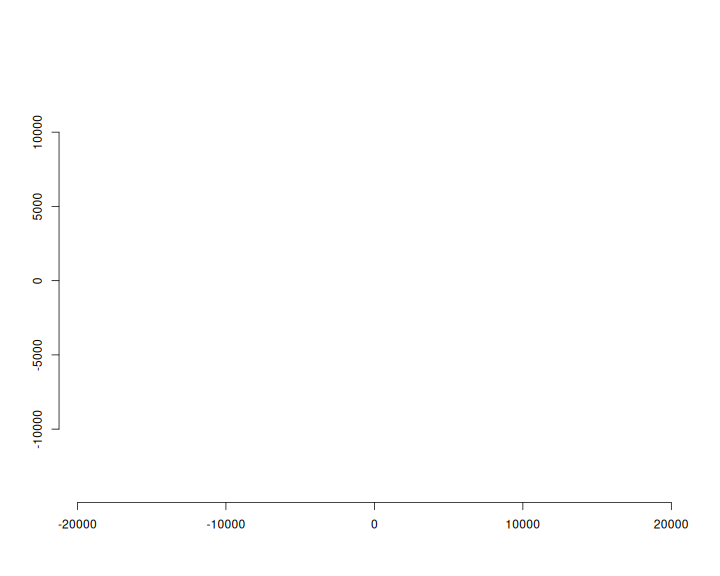
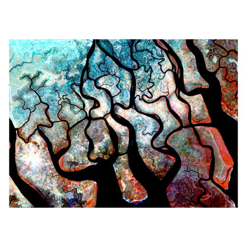
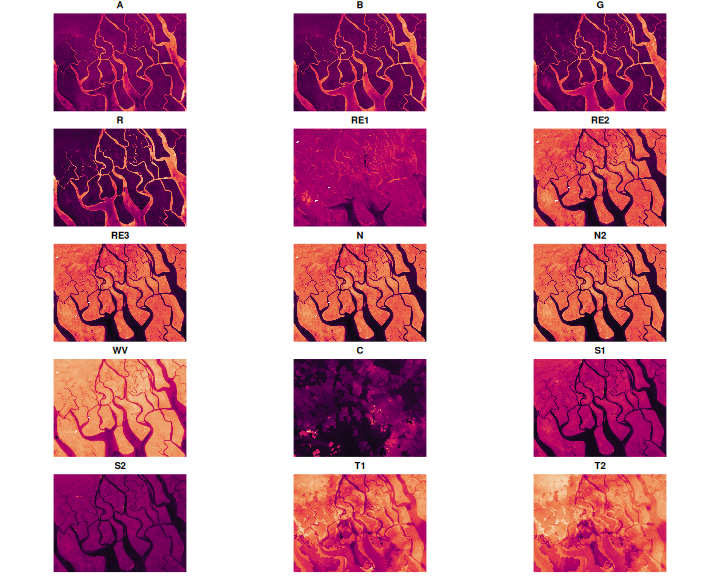

## Introduction

The Harmonized Landsat Sentinel-2 (HLS) project is fantastic dataset offering
global, harmonized surface reflectance data from Landsat 8 and Sentinel-2
satellites. The combined measurement enables global observations of the land 
every 2–3 days at 30-meter (m) spatial resolution. The data has a high quality
cloud/shadow bitmask layer, enabling the creation of excellent cloud-free
composites. Further information on HLS can be found at the following links:

- https://hls.gsfc.nasa.gov/

- https://lpdaac.usgs.gov/products/hlsl30v002/

- https://github.com/nasa/HLS-Data-Resources?tab=readme-ov-file

Combining the Harmonized landsat and sentinel collections does require some
additional work because the two collections have different numbers of bands with 
different names. 

This Vignette outlines a workflow to combine the two collections into a single
median composite image that maintains all available bands.

You will need to have an Earthdata account to access the HLS data. You can
create an account at https://urs.earthdata.nasa.gov/users/new.


## Workflow setup

First we load the `vrtility` package and set up our multiprocessing daemons
using the `mirai` package. Using mirai daemons allows for the automated speed
up of several of the vrtility processing steps.

Next we define our area of interest, we do this using the `gdalraster` package
but you can as easily simply provide a numeric vector (length 4) with lon/lat 
coordinates ordered by xmin, ymin, xmax, ymax.

When working with any raster data it is often more convenient to use a projected 
coordinate system. The `bbox_to_projected` function provides a convenient way
to reproject a bounding box, either with a specific spatial reference system 
(SRS) or using a default SRS appropriate for the area of interest. The default 
SRS is an equal area projection centered around the centroid of the bounding 
box.


``` r
library(vrtility)

mirai::daemons(machine_cores())
#> [1] 20
```

``` r

bbox <- gdalraster::bbox_from_wkt(
  wkt = "POINT (144.3 -7.6)",
  extend_x = 0.17,
  extend_y = 0.125
)

te <- bbox_to_projected(bbox)
trs <- attr(te, "wkt")
```

Now we need to find the data. we need to query both the HLS Landsat and Sentinel-2
collections. The `hls_stac_query` function provides a convenient way to do this.
First we will query the HLS Landsat collection. Here we set a maximum cloud cover
of 35% and a date range of 2023-01-01 to 2023-12-31. we can see that of a total
of 70 images, only 6 had less than 35% cloud cover. 


``` r
hlssl_stac <- hls_stac_query(
  bbox = bbox,
  start_date = "2023-01-01",
  end_date = "2023-12-31",
  max_cloud_cover = 35,
  collection = "HLSL30_2.0"
)
print(hlssl_stac)
#> ###Items
#> - matched feature(s): 70
#> - features (6 item(s) / 64 not fetched):
#>   - HLS.L30.T55MBM.2023017T003226.v2.0
#>   - HLS.L30.T54MZS.2023017T003226.v2.0
#>   - HLS.L30.T55MBM.2023065T003210.v2.0
#>   - HLS.L30.T54MZS.2023065T003210.v2.0
#>   - HLS.L30.T55MBM.2023337T003219.v2.0
#>   - HLS.L30.T54MZS.2023337T003219.v2.0
#> - assets: B01, B02, B03, B04, B05, B06, B07, B09, B10, B11, Fmask
#> - item's fields: 
#> assets, bbox, collection, geometry, id, links, properties, stac_extensions, stac_version, type
```

And now we will query the HLS Sentinel-2 collection using the same parameters.
Again we can see that < 10% of images have less than 35% cloud cover. 


``` r
hlsss_stac <- hls_stac_query(
  bbox = bbox,
  start_date = "2023-01-01",
  end_date = "2023-12-31",
  max_cloud_cover = 35,
  collection = "HLSS30_2.0"
)
print(hlsss_stac)
#> ###Items
#> - matched feature(s): 98
#> - features (8 item(s) / 90 not fetched):
#>   - HLS.S30.T54MZS.2023029T004701.v2.0
#>   - HLS.S30.T55MBM.2023074T004709.v2.0
#>   - HLS.S30.T55MBM.2023079T004701.v2.0
#>   - HLS.S30.T55MBM.2023109T004701.v2.0
#>   - HLS.S30.T54MZS.2023109T004701.v2.0
#>   - HLS.S30.T55MBM.2023319T004701.v2.0
#>   - HLS.S30.T55MBM.2023364T004709.v2.0
#>   - HLS.S30.T54MZS.2023364T004709.v2.0
#> - assets: 
#> B01, B02, B03, B04, B05, B06, B07, B08, B09, B10, B11, B12, B8A, Fmask
#> - item's fields: 
#> assets, bbox, collection, geometry, id, links, properties, stac_extensions, stac_version, type
```

In order to download the data we need to set up our Earthdata credentials. The 
simplest way to do this is with the 
[earthdatalogin](https://boettiger-lab.github.io/earthdatalogin/) package. But, 
because we are using asynchronous mirai daemons, we need to set the credentials 
for all daemons.


``` r
mirai::everywhere(
  earthdatalogin::edl_netrc(
    username = Sys.getenv("EARTHDATA_USER"),
    password = Sys.getenv("EARTHDATA_PASSWORD")
  )
)
```

Now we can begin forming the VRT pipeline. Here we "collect" all of the assets
from the STAC collections. This is essentially just a list of virtual rasters.
This can take a little time due to VRT validation -  however, GDAL caching 
makes re-accessing these remote files faster, for the subsequent parts of the
workflow.


``` r
hls_sl_col <- vrt_collect(hlssl_stac)
print(hls_sl_col)
#> → <VRT Collection>
#> 
#>  VRT SRS: 
#> PROJCS["WGS 84 / UTM zone 55N",GEOGCS["WGS 84",DATUM["WGS_1984",SPHEROID["WGS 84",6378137,298.257223563,AUTHORITY["EPSG","7030"]],AUTHORITY["EPSG","6326"]],PRIMEM["Greenwich",0,AUTHORITY["EPSG","8901"]],UNIT["degree",0.0174532925199433,AUTHORITY["EPSG","9122"]],AUTHORITY["EPSG","4326"]],PROJECTION["Transverse_Mercator"],PARAMETER["latitude_of_origin",0],PARAMETER["central_meridian",147],PARAMETER["scale_factor",0.9996],PARAMETER["false_easting",500000],PARAMETER["false_northing",0],UNIT["metre",1,AUTHORITY["EPSG","9001"]],AXIS["Easting",EAST],AXIS["Northing",NORTH],AUTHORITY["EPSG","32655"]]
#> 
#>  PROJCS["WGS 84 / UTM zone 54N",GEOGCS["WGS 84",DATUM["WGS_1984",SPHEROID["WGS 84",6378137,298.257223563,AUTHORITY["EPSG","7030"]],AUTHORITY["EPSG","6326"]],PRIMEM["Greenwich",0,AUTHORITY["EPSG","8901"]],UNIT["degree",0.0174532925199433,AUTHORITY["EPSG","9122"]],AUTHORITY["EPSG","4326"]],PROJECTION["Transverse_Mercator"],PARAMETER["latitude_of_origin",0],PARAMETER["central_meridian",141],PARAMETER["scale_factor",0.9996],PARAMETER["false_easting",500000],PARAMETER["false_northing",0],UNIT["metre",1,AUTHORITY["EPSG","9001"]],AXIS["Easting",EAST],AXIS["Northing",NORTH],AUTHORITY["EPSG","32654"]]
#> Bounding Box: NA
#> Pixel res: 30, 30
#> Start Date: 2023-01-17 00:32:26 UTC
#> End Date: 2023-12-03 00:32:19 UTC
#> Number of Items: 6
#> Assets: B01, B02, B03, B04, B05, B06, B07, B09, B10, B11, Fmask
```

``` r

hls_ss_col <- vrt_collect(hlsss_stac)
print(hls_ss_col)
#> → <VRT Collection>
#> 
#>  VRT SRS: 
#> PROJCS["WGS 84 / UTM zone 54N",GEOGCS["WGS 84",DATUM["WGS_1984",SPHEROID["WGS 84",6378137,298.257223563,AUTHORITY["EPSG","7030"]],AUTHORITY["EPSG","6326"]],PRIMEM["Greenwich",0,AUTHORITY["EPSG","8901"]],UNIT["degree",0.0174532925199433,AUTHORITY["EPSG","9122"]],AUTHORITY["EPSG","4326"]],PROJECTION["Transverse_Mercator"],PARAMETER["latitude_of_origin",0],PARAMETER["central_meridian",141],PARAMETER["scale_factor",0.9996],PARAMETER["false_easting",500000],PARAMETER["false_northing",0],UNIT["metre",1,AUTHORITY["EPSG","9001"]],AXIS["Easting",EAST],AXIS["Northing",NORTH],AUTHORITY["EPSG","32654"]]
#> 
#>  PROJCS["WGS 84 / UTM zone 55N",GEOGCS["WGS 84",DATUM["WGS_1984",SPHEROID["WGS 84",6378137,298.257223563,AUTHORITY["EPSG","7030"]],AUTHORITY["EPSG","6326"]],PRIMEM["Greenwich",0,AUTHORITY["EPSG","8901"]],UNIT["degree",0.0174532925199433,AUTHORITY["EPSG","9122"]],AUTHORITY["EPSG","4326"]],PROJECTION["Transverse_Mercator"],PARAMETER["latitude_of_origin",0],PARAMETER["central_meridian",147],PARAMETER["scale_factor",0.9996],PARAMETER["false_easting",500000],PARAMETER["false_northing",0],UNIT["metre",1,AUTHORITY["EPSG","9001"]],AXIS["Easting",EAST],AXIS["Northing",NORTH],AUTHORITY["EPSG","32655"]]
#> Bounding Box: NA
#> Pixel res: 30, 30
#> Start Date: 2023-01-29 00:49:07 UTC
#> End Date: 2023-12-30 00:49:10 UTC
#> Number of Items: 8
#> Assets: B01, B02, B03, B04, B05, B06, B07, B08, B8A, B09, B10, B11, B12, Fmask
```

The print method for vrt_collection objects gives us a high level overview of
the imagery we will download. Our collections contain images with two different
SRS. We can also see that the number of bands differs across the two 
collections.

Now we need to align these data so that we can composite all the imagery in one 
go. We can do this by simply adding nodata bands where required. In the case 
of the HLS Landsat collection, we also need to move the position of the cirrus
band to match that of the HLS Sentinel-2 collection.

Similarly, with HLS Sentinel-2, we need to add the thermal bands that are 
absent, but critically, note that we need to specify the scale value for these
bands. If this isn't provided then the scale from the first band is used 
(which in this case is 0.0001) or if there is no scale, it is ignored. Automating
this is tricky but if you miss an appropriate scale, you will see warnings 
when you then use `vrt_stack`.


``` r
hls_ls_align <- vrt_set_band_names(
  hls_sl_col,
  c("A", "B", "G", "R", "N2", "S1", "S2", "C", "T1", "T2", "Fmask")
) |>
  vrt_add_empty_band(after = 4, description = "RE1") |>
  vrt_add_empty_band(after = 5, description = "RE2") |>
  vrt_add_empty_band(after = 6, description = "RE3") |>
  vrt_add_empty_band(after = 7, description = "N") |>
  vrt_add_empty_band(after = 9, description = "WV") |>
  vrt_move_band(band_idx = 13, after = 10)


hls_ss_align <- vrt_set_band_names(
  hls_ss_col,
  c("A", "B", "G", "R", "RE1", "RE2", "RE3", "N", "N2", "WV", "C", "S1", "S2", "Fmask")
) |>
  vrt_add_empty_band(after = 13, description = "T1", scale_value = 0.01) |>
  vrt_add_empty_band(after = 14, description = "T2", scale_value = 0.01)
```

Now we can combine the two collections into a single collection using the `c` 
method. This is a simple concatenation of the two collections.


``` r
hls_merge_coll <- c(
  hls_ls_align,
  hls_ss_align
)
```


Now we set the mask function required for the HLS data. The "Fmask" band is a 
true bitmask (unlike other datasets which may use ineger masks). Therefore
we must use the `build_bitmask` function to set the mask and can specify the
bits that we wish to set as no-data across all bands.


``` r
hls_col_mask <- vrt_set_maskfun(
  hls_merge_coll,
  mask_band = "Fmask",
  mask_values = c(0, 1, 2, 3),
  build_mask_pixfun = build_bitmask(),
  drop_mask_band = TRUE
)

# let's check out a vrt and inspect the mask function that we used.
print(hls_col_mask, maskfun = TRUE)
#> → <VRT Collection>
#> Mask Function:
#> import numpy as np
#> def build_bitmask(in_ar, out_ar, xoff, yoff, xsize, ysize, raster_xsize,
#>                   raster_ysize, buf_radius, gt, **kwargs):
#>     bit_positions = [int(x) for x in kwargs['mask_values'].decode().split(',')]
#>     mask = np.zeros_like(in_ar[0], dtype=bool)
#>     for bit in bit_positions:
#>         mask |= np.bitwise_and(in_ar[0], np.left_shift(1, bit)) > 0
#>     out_ar[:] = np.where(mask, 0, 1)
#> 
#> 
#>  VRT SRS: 
#> PROJCS["WGS 84 / UTM zone 55N",GEOGCS["WGS 84",DATUM["WGS_1984",SPHEROID["WGS 84",6378137,298.257223563,AUTHORITY["EPSG","7030"]],AUTHORITY["EPSG","6326"]],PRIMEM["Greenwich",0,AUTHORITY["EPSG","8901"]],UNIT["degree",0.0174532925199433,AUTHORITY["EPSG","9122"]],AUTHORITY["EPSG","4326"]],PROJECTION["Transverse_Mercator"],PARAMETER["latitude_of_origin",0],PARAMETER["central_meridian",147],PARAMETER["scale_factor",0.9996],PARAMETER["false_easting",500000],PARAMETER["false_northing",0],UNIT["metre",1,AUTHORITY["EPSG","9001"]],AXIS["Easting",EAST],AXIS["Northing",NORTH],AUTHORITY["EPSG","32655"]]
#> 
#>  PROJCS["WGS 84 / UTM zone 54N",GEOGCS["WGS 84",DATUM["WGS_1984",SPHEROID["WGS 84",6378137,298.257223563,AUTHORITY["EPSG","7030"]],AUTHORITY["EPSG","6326"]],PRIMEM["Greenwich",0,AUTHORITY["EPSG","8901"]],UNIT["degree",0.0174532925199433,AUTHORITY["EPSG","9122"]],AUTHORITY["EPSG","4326"]],PROJECTION["Transverse_Mercator"],PARAMETER["latitude_of_origin",0],PARAMETER["central_meridian",141],PARAMETER["scale_factor",0.9996],PARAMETER["false_easting",500000],PARAMETER["false_northing",0],UNIT["metre",1,AUTHORITY["EPSG","9001"]],AXIS["Easting",EAST],AXIS["Northing",NORTH],AUTHORITY["EPSG","32654"]]
#> Bounding Box: NA
#> Pixel res: 30, 30
#> Start Date: 2023-01-17 00:32:26 UTC
#> End Date: 2023-12-30 00:49:10 UTC
#> Number of Items: 14
#> Assets: A, B, G, R, RE1, RE2, RE3, N, N2, WV, C, S1, S2, T1, T2
```

Now we want to "reduce" the imagery collection to a single composite image. The
typical approach would be to use the band-level median which we can achieve 
easily first creating a virtual warped raster collection using `vrt_warp` and 
then stacking the warped collection using `vrt_stack`. Here we can now apply
the python median pixel function using `vrt_set_py_pixelfun` before computing
the final composite using `vrt_compute`.


``` r
# not run
band_level_median <- vrt_warp(
  hls_col_mask,
  t_srs = trs,
  te = te,
  tr = c(30, 30),
  resampling = "bilinear"
) |>
  vrt_stack() |>
  vrt_set_py_pixelfun(pixfun = median_numpy()) |>
  vrt_compute(fs::file_temp(ext = ".tif"),
    engine = "gdalraster"
  )
```

However, we can also create composites using more advanced statistical methods 
that can improve on the filtering of outliers, increase scene consistency and
ensure that spectral properties are preserved. Several functions are provided
in the `vrtility` package to do this but the user can also provide their own 
if desired. Here we will use the `geomedian` function which calculates the 
geometric (aka spatial median). This synthetic statistic ensures consistency 
across bands. Note we can also use other functions such as `medoid` or 
`quantoid`, or `geomedoid` to obtain different types of composite that all 
preserve the spectral properties of the data.

In theory we can also just run:


``` r
# not run
hls_composite <- vrt_warp(
  hls_col_mask,
  t_srs = trs,
  te = te,
  tr = c(30, 30),
  resampling = "bilinear"
) |>
  multiband_reduce(reduce_fun = geomedian())
```
But the  NASA Earthdata server seems to object to multiple concurrent reads on 
a single file and so this can be a bit slow. Therefore we can download multiple 
files in parallel by using the "warp" engine in `vrt_compute()`. This downloads 
all files locally - from here we can then build the geomedian composite as 
above. by warping during the `vrt_compute` step can align all images in the 
collection to the same spatial reference system, extent and pixel size. This is 
particularly important in this case because of the multiple SRS values in the 
collection.


``` r
hls_imgs <- hls_col_mask |>
  vrt_compute(
    fs::file_temp(ext = ".tif"),
    t_srs = trs,
    te = te,
    tr = c(30, 30),
    resampling = "bilinear",
    engine = "warp"
  )
hls_composite <- hls_imgs |>
  vrt_collect() |>
  vrt_warp(
    t_srs = trs,
    te = te,
    tr = c(30, 30)
  ) |>
  multiband_reduce(reduce_fun = geomedian())
```

Now let's take a look at the composite - first RGB and then a false colour 
composite.


``` r
withr::with_par(list(mar = c(0, 0, 0, 0)), {
  plot_raster_src(
    hls_composite,
    bands = c(4, 3, 2),
    axes = FALSE
  )

  plot_raster_src(
    hls_composite,
    bands = c(9, 12, 13),
    minmax_pct_cut = c(28, 97),
    axes = FALSE
  )
})
```



And all the other bands too:


``` r
withr::with_par(
  list(mfrow = c(5, 3), mar = c(0, 0, 1, 0)),
  purrr::walk(1:15, function(i) {
    plot_raster_src(
      hls_composite,
      bands = i,
      pal = hcl.colors(256, "Rocket"),
      legend = FALSE,
      axes = FALSE
    )
  })
)
```



