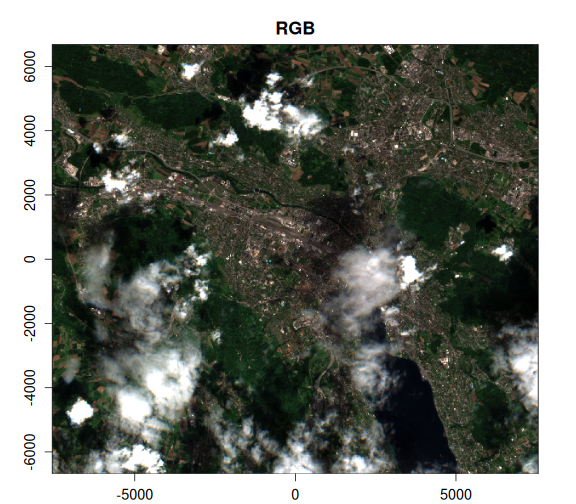
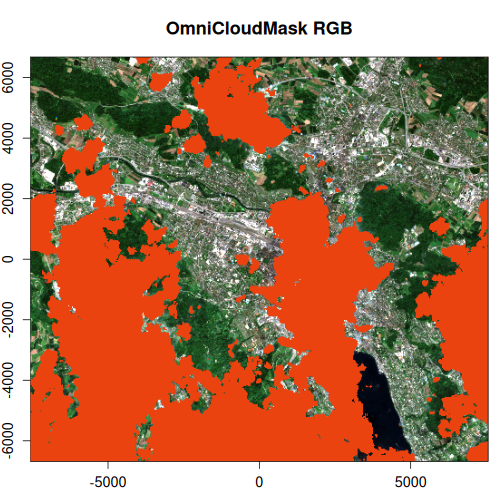
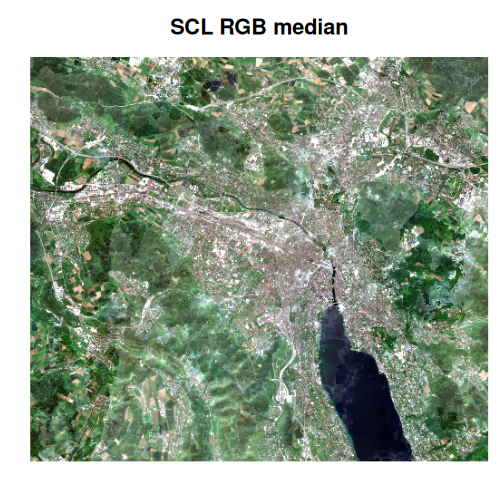

One of the most powerful features of VRT python pixel functions is the ability 
to run any python code on a raster dataset, on the fly. The potential value here
is massive and vrtility only scratches the surface of what is possible here. 

In this vignette, we will demonstrate how to use the OmniCloudMask model to create
a cloud mask for Sentinel-2 imagery.
"OmniCloudMask Python library for state-of-the-art cloud and cloud shadow 
segmentation in high to moderate resolution satellite imagery"; it is an 
incredible project so please also check out their 
[GitHub repository](https://github.com/DPIRD-DMA/OmniCloudMask). By providing 
only the red, green and near-infrared bands, the model can create a cloud mask
using a pre-trained convolutional neural network (CNN) model. 

vrtility provides a streamlined way to "bake-in" this cloud masking right into a 
VRT file! The cloud mask is significantly better than most provided masking 
products included with for example Sentinel L2A and Landsat. 

Let's work around Zurich and really test the limits of these masks - retaining 
imagery with up to 80% cloud cover. 

``` r
library(vrtility)

bbox <- gdalraster::bbox_from_wkt(
  wkt = "POINT (8.51 47.38)",
  extend_x = 0.1,
  extend_y = 0.06
)

te <- bbox_to_projected(bbox)
trs <- attr(te, "wkt")

s2_stac <- sentinel2_stac_query(
  bbox = bbox,
  start_date = "2024-04-01",
  end_date = "2024-05-30",
  max_cloud_cover = 80,
  assets = c("B02", "B03", "B04", "B08", "SCL")
)
# number of items:
length(s2_stac$features)
#> [1] 9
```

Now let's get all of these rasters locally -  this isn't usually needed but 
we can't run the cloud mask inference in parallel (at least not on my poor 
laptop). So using `with` we can isolate the application of our mirai daemons 
like so to download the data:


``` r
with(mirai::daemons(6), {
  zurich_vrt <- vrt_collect(s2_stac) |>
    vrt_warp(
      t_srs = trs,
      te = te,
      tr = c(10, 10)
    ) |>
    vrt_compute(
      outfile = fs::file_temp(ext = ".tif"),
      recollect = TRUE
    )
})
```

At this point, we can now create a mask using the `vrt_create_mask` function.
Note that there are two key arguments, `inbands` and `maskfun`. `inbands`
must be a named numeric vector, with names corresponding to the required bands
for the pixel mask string passed to `maskfun`. At present, the only available masking
function is `create_omnicloudmask()`. The `vrt_create_mask` function is
designed such that it can handle mask functions that may be added in the future.

Once the mask is created, it will be added as a new band to the VRT object. We 
can then compute the mask with `vrt_compute()`, which will then materialize
the mask as a new raster file. Note that we use `recollect = TRUE` to return
a new `vrt_collection` object because we plan to do some further processing.


``` r
zurich_vrt_mask <- zurich_vrt |>
  vrt_create_mask(
    inbands = c(red = 3, green = 2, nir = 4),
    maskfun = create_omnicloudmask()
  ) |>
  vrt_compute(
    fs::file_temp(ext = ".tif"),
    recollect = TRUE
  )
```

Now, let's take at the OmniCloudMask and the Sentinel-2 SCL bands, alongside
the RGB image. We can clearly see that the OmniCloudMask is identifying a
greater area of clouds and shadows.


``` r
purrr::walk2(
  .x = list(c(3, 2, 1), 5, 6),
  .y = c("RGB", "SCL", "OmniCloudMask"),
  ~ plot(
    zurich_vrt_mask,
    item = 2,
    .x,
    main = .y,
    legend = FALSE,
    axes = FALSE,
    na_col = "#b6b6b6"
  )
)
```




Right okay, so what does this mean for the actual masked areas? Let's apply
the masks and compare an image to see how the performance compares between
OmniCloudMask and the Sentinel-2 SCL band. Note that when using 
`vrt_set_maskfun()`, we can specify the mask values to be used for masking. 
In the case of the OmniCloudMask, the values range from 0 to 3, where
0 is clear, 1 is thick cloud, 2 is thin cloud, and 3 is cloud shadow. We're 
going to mask any of these classes.


``` r
scl_rgb <- zurich_vrt_mask |>
  vrt_set_maskfun(
    mask_band = "SCL",
    mask_values = c(0, 1, 2, 3, 8, 9, 10, 11)
  )

ocm_rgb <- zurich_vrt_mask |>
  vrt_set_maskfun(
    mask_band = "omnicloudmask",
    mask_values = 1:3
  )

purrr::walk2(
  list(scl_rgb, ocm_rgb),
  c("SCL RGB", "OmniCloudMask RGB"),
  ~ plot(
    .x,
    item = 2,
    c(3, 2, 1),
    main = .y,
    axes = FALSE,
    na_col = "#eb4310"
  )
)
```




Clearly, the OmniCloudMask is doing a much better job of capturing more of the
clouds and shadows - it even seems to remove some false positives that exist 
in the SCL band. 

Finally, let's compute the median of the RGB bands for both the SCL and 
OmniCloudMask masked images and plot the results...


``` r
scl_median <- vrt_stack(scl_rgb) |>
  vrt_set_py_pixelfun(pixfun = mean_numpy()) |>
  vrt_compute(outfile = fs::file_temp(ext = ".tif"))

ocm_median <- vrt_stack(ocm_rgb) |>
  vrt_set_py_pixelfun(pixfun = mean_numpy()) |>
  vrt_compute(outfile = fs::file_temp(ext = ".tif"))

purrr::walk2(
  list(scl_median, ocm_median),
  list("SCL RGB median", "OmniCloudMask RGB median"),
  ~ plot_raster_src(
    .x,
    item = 1,
    c(3, 2, 1),
    main = .y,
    axes = FALSE
  )
)
```



We can see a huge difference between the two median images. The OmniCloudMask
is very clear whereas the SCL-masked image is very "milky", clearly a lot
of cloud artefacts remain. We could easily improve the SCL composite by being
discarding more cloudy images but this serves as a great example of how improving
cloud masking can provide a major benefit! We could also further enhance this
composite using the multi-dimensional reduction functions available from
`multiband_reduce()`.

