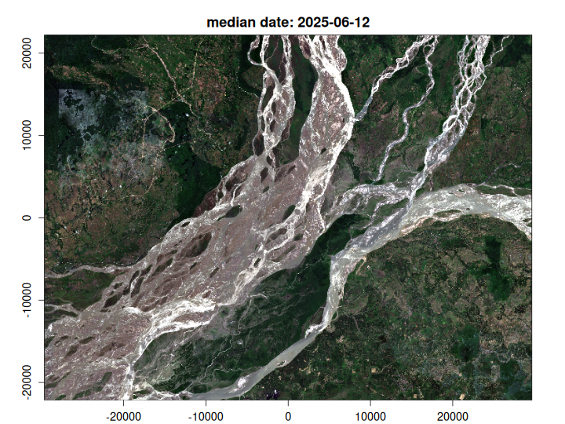

The Copernicus Data Space Ecosystem (CDSE) provides access to a large range of
European Space Agency (ESA) and Copernicus data. They also provide a STAC API
for querying and accessing the data. However, there are some unique aspects to
working with the CDSE via gdal - firstly that authentication is a bit unique and
secondly (and most critically), the Sentinel-2 data is stored in the Jpeg2000
format, rather than the more common Cloud Optimised GeoTIFF (COG) format. 
This has a couple of disadvantages, the main one being that, as the files aren't
cloud optimised, we often have to download more than we need to, there is also 
no embedded metadata describing values such as nodata, scale and offset.

But we can still make good use of these data so let's get to it. Firstly here 
are some handy links: 

CDSE STAC catalog:

https://browser.stac.dataspace.copernicus.eu/?_language=en&.language=en

CDSE STAC API documentation:

https://documentation.dataspace.copernicus.eu/APIs/STAC.html

CDSE API quota:

https://documentation.dataspace.copernicus.eu/Quotas.html

## Authentication. 
Get the official authentication documentation [here](https://documentation.dataspace.copernicus.eu/APIs/S3.html).

You will need a CDSE account to access the data. Get yourself one from 
[here](https://identity.dataspace.copernicus.eu/auth/realms/CDSE/protocol/openid-connect/auth?client_id=cdse-public&response_type=code&scope=openid&redirect_uri=https%3A//dataspace.copernicus.eu/account/confirmed/1).

Once, you're registred, navigate to the [S3 credentials page](https://eodata-s3keysmanager.dataspace.copernicus.eu/)
and create an "access key" and a "secret access key". Then Save these keys in your
`.Renviron` file as `CDSE_ACCESS_KEY` and `CDSE_SECRET_KEY` respectively.


## Set up the environment

first we need to load vrtility and then set up parallel processing. You must not 
set more than 4 daemons, as this is the limit for concurrent requests to the 
CDSE API.


``` r
library(vrtility)

# only use 4 daemons!
mirai::daemons(4)
#> [1] 4
```

## Query the STAC API

We can now query the STAC API for the Sentinel-2 data. Here we are looking at 
the level-2A data which is orthorectified bottom-of-atmosphere reflectance. 

We define our bounding bounding box (located in Assam, India) using {gdalraster}
for convenience and also create a copy in a local projection system - we'll use
this later to warp the data to a common projection.

We'll query the data for the month of June 2025, select the bands we want to 
download (here we're grabbing, blue, green, red, near-infrared and the scene 
classification layer), and finally filter the results to only include
images with a maximum cloud cover of 30%.


``` r
bbox <- gdalraster::bbox_from_wkt(
  wkt = "POINT (95.415 27.78)",
  extend_x = 0.3,
  extend_y = 0.2
)
bbx_proj <- bbox_to_projected(bbox)

# run the STAC query
s2copdse <- stac_query(
  bbox = bbox,
  stac_source = "https://stac.dataspace.copernicus.eu/v1",
  collection = "sentinel-2-l2a",
  start_date = "2025-06-01",
  end_date = "2025-06-30"
) |>
  rstac::assets_select(
    asset_names = c("B02_10m", "B03_10m", "B04_10m", "B08_10m", "SCL_20m")
  ) |>
  stac_cloud_filter(max_cloud_cover = 30)
```

## Download and create a "cloud-free" median composite

Now we have our STAC query, we can create a `vrt_collection` object which 
encapsulates all the image assets as VRT datasets. Note that we need to set some 
GDAL environment variables. For more details on the significance of these 
variables see the GDAL [vsis3 documentation](https://gdal.org/en/stable/user/virtual_file_systems.html#vsis3-aws-s3-files).
We then need to add important metadata to the VRT files including the nodata, 
scale and offset values. 

Next we apply a mask to the data using the scene classification layer (SCL) to 
remove cloudy pixels. this isn't a perfect mask but it is a good start (more on 
that to come in the future). 

Then we create a collection of virtually warped VRTs, which are aligned to a common
spatial reference system (SRS) and resolution. This is done using the `vrt_warp` function
and we specify the target SRS, the extent of the data and the target resolution.

The next step requires us to stack the collection (essentially combining each 
band from across epochs), we can then set a pixel function to calculate the
median value for each pixel across the stack.

Finally, we compute the median composite using the `vrt_compute` function,
which writes the output to a file. We use the `gdalraster` engine to
process the data in parallel across bands and image tiles.


``` r
# Download the data and process
s2_median <- vrt_collect(s2copdse,
  gdal_config_opts(
    AWS_VIRTUAL_HOSTING = "FALSE",
    AWS_ACCESS_KEY_ID = Sys.getenv("CDSE_ACCESS_KEY"),
    AWS_SECRET_ACCESS_KEY = Sys.getenv("CDSE_SECRET_KEY"),
    AWS_S3_ENDPOINT = "eodata.dataspace.copernicus.eu"
  )) |>
  vrt_move_band(1, 5) |>
  vrt_set_nodata(0, band_idx = 1:4) |>
  vrt_set_scale(scale_value = 0.0001, offset_value = -0.1) |>
  vrt_set_maskfun(
    mask_band = "SCL_20m",
    mask_values = c(0, 1, 2, 3, 8, 9, 10, 11),
    drop_mask_band = TRUE
  ) |>
  vrt_warp(
    t_srs = attr(bbx_proj, "wkt"),
    te = bbx_proj,
    tr = c(10, 10)
  ) |>
  vrt_stack() |>
  vrt_set_py_pixelfun(median_numpy()) |>
  vrt_compute(
    outfile = fs::file_temp(ext = "tif"),
    engine = "gdalraster"
  )
```

## Visualise the results

Finally, let's plot the NIR band on its own and then the RGB composite.


``` r
plot_raster_src(s2_median, bands = 4)
```


``` r

plot_raster_src(s2_median, bands = c(3, 2, 1))
```


