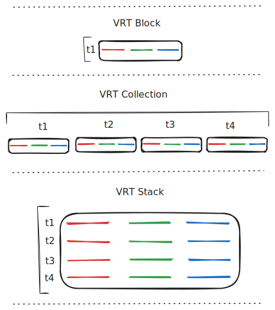

```{r, include = FALSE}
knitr::opts_chunk$set(
  collapse = TRUE,
  comment = "#>"
)
```

```{r setup}
library(vrtility)
```

## Overview

The `vrtility` package is built around three core data structures that represent
virtual rasters at different levels of organization: **`vrt_block`**, **`vrt_collection`**, and **`vrt_stack`**. Understanding these structures is key to working effectively with the package's VRT-based pipelines.
Figure 1 provides a visual overview of these data structures and their relationships.
which are discussed in detail below.

```{r data-concepts-figure, echo=FALSE, out.width="100%", fig.cap="Figure 1: Core data structures in vrtility: `vrt_block`, `vrt_collection`, and `vrt_stack`. Red, green, and blue lines represent raster bands; black boxes represent VRT files; t* labels indicate discrete epochs (time steps)."}

```

There is considerable jargon in the GIS world regarding multidimensional raster 
data. The term "data cube" is commonly used for spatiotemporal rasters, but we 
feel this metaphor breaks down for multiband/multi-spectral data. In reality, 
we have interconnected "cubes" linked by a space-time index. We prefer "stack" 
over "cube" when referring to the temporal dimension of our data, aligning with 
GDAL terminology and establishing a clearer mental model.

However, "stacking" sometimes refers to adding bands to a multiband raster. 
**For clarity: in vrtility, "stack" always refers to aligning bands representing 
the same phenomenon across multiple time steps into a single virtual raster.**


## Core Data Structures

### vrt_block: The Basic Building Block 😉 

A **`vrt_block`** represents a single virtual raster (VRT) with one or more 
bands. It is the fundamental unit in vrtility's pipeline system.

**Key characteristics:**

- Contains a single VRT XML definition

- Has a single spatial reference system (SRS)

- Contains one or more raster bands (e.g., B02, B03, B04)

- Can be created from one or more data sources.

- May include metadata like timestamps and no-data values

- Stores optional mask and pixel functions

```{r vrt-block-example}
# Load example Sentinel-2 data
s2files <- fs::dir_ls(system.file("s2-data", package = "vrtility"))

# Create a vrt_collection and extract the first block
ex_collect <- vrt_collect(s2files, datetimes = c(
  "2020-01-01T10:15:30Z", # dates made up for example
  "2020-02-01T10:15:30Z",
  "2020-03-01T10:15:30Z",
  "2020-04-01T10:15:30Z",
  "2020-05-01T10:15:30Z"
))
single_block <- ex_collect[[1]][[1]]

# Print the block to see its structure
print(single_block)
```

A `vrt_block` contains:

- `vrt`: The XML representation of the VRT

- `vrt_src`: Path to the VRT file

- `srs`: Spatial reference system

- `bbox`: Bounding box (extent)

- `res`: Pixel resolution

- `assets`: Band names (e.g., "B02", "B03", "B04")

- `date_time`: Timestamp(s)

- `no_data_val`: NoData value(s) for each band

- `pixfun`: Optional pixel function code

- `maskfun`: Optional mask function code

- `warped`: Whether the VRT has been spatially aligned

- `is_remote`: Whether the data source is remote (e.g., S3)

### vrt_collection: Temporal Series of Blocks

A **`vrt_collection`** is a list of `vrt_block` objects, typically representing 
a time series of observations over the same geographic area.

**Key characteristics:**

- Contains multiple `vrt_block` objects (e.g., t1, t2, t3, t4)

- Each block typically has the same set of bands (e.g., B02, B03, B04)

- Blocks may have different timestamps

- Blocks may have different spatial references and extents until warped

- Component blocks can be warped to a common grid using `vrt_warp()`

- Inherits from `vrt_block`, so supports the same operations

```{r vrt-collection-example}
# Print collection summary
print(ex_collect)

# A collection is a list of blocks
length(ex_collect[[1]])

# Access individual blocks
print(ex_collect[[1]][[1]]) # First time step
print(ex_collect[[1]][[2]]) # Second time step
```

A `vrt_collection` extends `vrt_block` with:

- `n_items`: Number of blocks in the collection

- List structure where `[[1]]` or `$vrt` contains the blocks

- Aggregated metadata from all blocks (e.g., combined timestamps)

**Common workflow:**

Note that when we print the warped collection, we see that the collections 
bounding box is returned rather than NA, indicating that the collection has been
warped to a common grid.
```{r collection-workflow}
# 2. Apply transformations (masking, scaling)
ex_masked <- ex_collect |>
  vrt_set_maskfun(
    mask_band = "SCL",
    mask_values = c(0, 1, 2, 3, 8, 9, 10, 11)
  )

# 3. Align to common grid
t_block <- ex_collect[[1]][[1]]
ex_warped <- vrt_warp(
  ex_masked,
  t_srs = t_block$srs,
  te = t_block$bbox,
  tr = t_block$res
)

print(ex_warped)

# 4. Compute or stack for further processing
```

There are two functions which only support `vrt_collection` objects:
- `multiband_reduce()`: Apply band reductions that require information from 
across the band range (e.g. geometric median or medoid).
- `singleband_m2m()`: Apply time-series pixel functions that operate across 
time steps.

In these cases, the collection structure better supports data access because, 
these operations are carried out by R, rather than GDAL. 


### vrt_stack: Transposed Multi-Temporal View

A **`vrt_stack`** reorganizes a `vrt_collection` by stacking all time steps into 
a single VRT with multiple sources per original band.

**Key characteristics:**
- Transposes the collection structure: think of a vrt collection being like 
a table with a wide format and the stack being the long format.

- If a collection has 4 time steps and three bands, the resulting stack will have
3 bands each with 4 sources (one per time step).

- Bands are grouped by original band name (all B02, then all B03, etc.)

- Enables temporal operations (e.g., median, mean) across time. Note this can 
only be done at the band-level only, not across bands as in `multiband_reduce()`.

- Single VRT file representing the entire time series

```{r vrt-stack-example}
# Stack a warped collection
ex_stack <- vrt_stack(ex_warped)

# Print stack info
print(ex_stack)

# A stack consolidates all time steps into bands
# If collection had 4 dates × 3 bands = 12 bands in stack
```

**Structure comparison:**

This table summarizes the differences between the three data structures for 
a typical STAC collection using Cloud Optimized GeoTIFFs for each asset.

| Structure        | Organization           | Example (4 dates, 3 bands) |
|------------------|------------------------|-------------------------|
| `vrt_block`      | 1 VRT file; N bands; N sources  | [B02, B03, B04]         |
| `vrt_collection` | M VRT files; N bands; N sources      | t1: [B02, B03, B04]<br>t2: [B02, B03, B04]<br>t3: [B02, B03, B04]<br>t4: [B02, B03, B04] |
| `vrt_stack`      | 1 VRT; N bands; M sources per band | Band 1: [B02_t1, B02_t2, B02_t3, B02_t4]<br>Band 2: [B03_t1, B03_t2, B03_t3, B03_t4]<br>Band 3: [B04_t1, B04_t2, B04_t3, B04_t4] |
**Why stack?**
Stacking enables pixel functions that operate across time. The following
example shows how to apply a temporal median function across the stacked bands,
returning a new `vrt_block` with median values for each original band.


```{r stack-operations}
# Apply temporal median
tblock <- ex_collect[[1]][[1]]
median_composite <- ex_stack |>
  vrt_set_py_pixelfun(pixfun = median_numpy()) |>
  vrt_compute(
    t_srs = t_block$srs,
    te = t_block$bbox,
    tr = t_block$res,
    recollect = TRUE
  )

print(median_composite)
```

## Class Hierarchy

All three structures inherit from `vrt_block`:

```
vrt_block (base class)
├── vrt_collection (extends vrt_block)
│   ├── vrt_collection_warped (when warped = TRUE)
│   └── Contains: [[1]] = list of vrt_block objects
└── vrt_stack (extends vrt_block)
    ├── vrt_stack_warped (when warped = TRUE)
    └── Contains: Bands with multiple sources (one per time step)
```

This means:

- All structures support the same core operations (`vrt_warp()`, `vrt_set_maskfun()`, etc.)

- Collections and stacks have additional metadata (`n_items`, aggregated timestamps)

- Type checking ensures operations are valid for each structure

## Other Key Concepts

### Virtual vs Materialized

- **Virtual**: Operations stored as VRT XML, no data processing yet

- **Materialized**: `vrt_compute()` executes the pipeline and writes output

### Lazy Evaluation

Most operations return a new VRT structure immediately without processing data. 
This enables:

- Building complex pipelines efficiently
- Modifying pipelines before execution  
- Processing only what's needed

**Important distinction from other tools:** Unlike {gdalcubes} or Python 
libraries such as OpenDataCube and other xarray-based tools, vrtility does not 
strictly enforce lazy evaluation. VRT transformations are partially lazy—limited 
processing occurs at each step, but materialization happens at key points such 
as warping remote data sources.

**Rationale:** This design allows easier interaction with data at each pipeline 
step, avoiding repeated downloads or reprocessing during development.

**Remote data behavior:** By default, `vrt_warp()` downloads required data for 
the area of interest from remote sources. Set `lazy = TRUE` to defer downloading 
(useful for plotting or some exploratory analysis).

### Warped Flag

The `warped` flag indicates whether a VRT has been aligned to a common grid:

- **Unwarped**: Blocks may have different SRS/resolutions/extents

- **Warped**: All blocks share the same SRS, extent, and resolution

Some operations (like `vrt_stack()`) require warped collections. 


## Summary

- **`vrt_block`**: Single raster with bands (Figure 1, left panel)
- **`vrt_collection`**: Time series of blocks (Figure 1, middle panel)
- **`vrt_stack`**: Transposed collection into single VRT (Figure 1, right panel)
- All structures support the same core operations through class inheritance
- Typical workflow: collect → warp → stack/compute